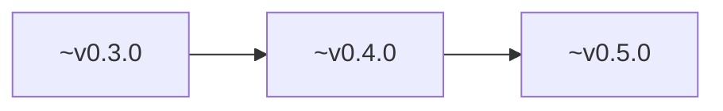
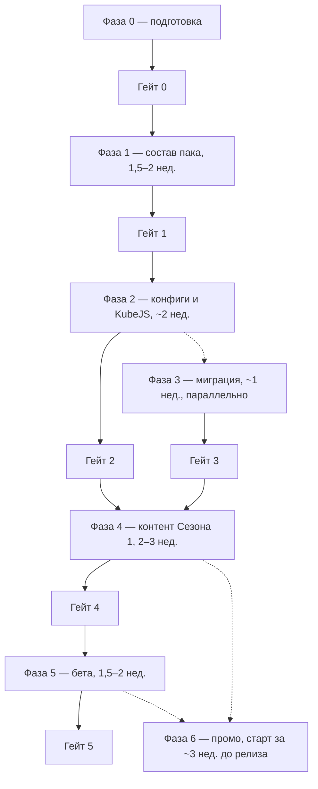

# Роадмап

!!! info "Источник"
    Доска Miro [MC Aeronautics: Ikaria](https://miro.com/app/board/uXjVH_pMSgk=/), выгрузка 09.10.2026. **Календарных дат нет** — ниже только то, что написано на доске (недели, гейты, сезоны). Чекбоксы фаз на доске **ни у одного пункта не отмечены**.

!!! warning "Что не считать утверждённым"
    Таймлайн «Main Roadmap» почти пустой. Длинные тексты («План: Этап 0…», чек-лист фаз, «Привлечение игроков») выглядят как вставленные ответы ИИ-консультанта («Ваша идея…», обрывы на середине абзаца). Это **рекомендации**, пока команда их явно не закрыла. Единственный живой статус работ — [канбан в бэклоге](backlog.md).

---

## Сезоны {: #seasons }

| Сезон | Откуда на доске | Что сказано |
|-------|-----------------|-------------|
| **MVP / Сборка 1.0** | тег `MVP` (14 задач), колонка «Тестирование»: «Собрать MVP сборки 1.0»; раскладка модов «Сборка 1.0» по слоям 1–4 | Ядро: зоны, клеймы, маркет, экзамен пилота, захват waystone — в списке приоритетов, не как закрытый чек-лист |
| **Сезон 1** | тег `1 сезон`; фазы 3–6 чек-листа («Контент Сезона 1») | Свинцовые/стальные острова, бункер, NPC с огнестрелом, лут улучшений оружия, порох из криперов |
| **Сезон 2** | заметка TBD: «2 сезон — Create + Apotheosis»; рядом «Create: Apokinetics»; «полноценные моды — на второй сезон» | Кандидаты, не план работ |

В блоке про маркетинг (тот же консультантский текст) сезоны описаны как **3–4 месяца** с финальным событием «гнев богов», вайпом диких земель и сохранением зоны строителей. **Это не датированный график** и не решение канбана.

---

## Версии на таймлайне

На фрейме «Main Roadmap» три маркера с баннерами «AERONAUTICS: SKY ISLANDS». Номера сняты с превью ~120×67 px, **могут быть ошибочными**:

Дорожки «ASI: Server side» и «ASI: Client Side» **пустые**: ни задач, ни дат, ни описаний к версиям. В `pack.toml` сейчас **0.6.2** — баннеры на доске, скорее всего, устарели или прочитаны неточно. Соответствие «версия баннера = фаза» на доске **не задано**.

---

## Фазы 0–6 (чек-лист с гейтами)

Самый конкретный роадмап на доске. Оценки — **недели работы**, не календарь. Текст фазы 6 обрывается на «spark е…».

### Фаза 0 — подготовка

Заголовка «Фаза 0» на доске нет, пункты идут списком.

- Ветки `dev` / `release` в MC-ASI-Online, публичность репо
- Строка запуска у хостера → packwiz-installer на `release/pack.toml`
- Скелет `kubejs/` (`_constants.js`, папки recipes / progression / events)
- Полный бэкап продового мира **в два места** (условие входа в фазу 3)
- Убрать колонку «библиотеки» из планирования

**Гейт 0:** пустой стейдж-сервер стартует из release-ветки packwiz без ручных действий.

### Фаза 1 — состав пака и первый стабильный билд

Ориентир на доске: **~1,5–2 недели**. Два трека.

**Трек A — решения по списку модов:** санация (JEI вон, дубли Xaero's вон, villager-моды минимум); фильтр «вырезаемое vs живой мир»; аудит Sinytra Connector (если через него >2–3 модов — искать замены); проверка на NeoForge 1.21.1: Heracles, YAWP, EntityJS, LootJS; Create: Gunsmithing — добавить и изучить.

**Трек B — сборка волнами** (после каждой — час игры на стейдже; краш ищут в последней волне):

1. слой 1 (ядро Create + Aeronautics) + минимум QoL
2. остальной QoL + клиентский слой (`side=client`)
3. контент слоя 2 + Gunsmithing
4. социальное + «вкусовщина»

**Гейт 1:** полный пак стартует, час геймплея без крашей, лог без ошибок (warn — в бэклог).

### Фаза 2 — конфиги и скрипты ядра

Ориентир: **~2 недели**, параллелится с хвостом фазы 1.

Конфиги по важности: OPAC (спавн/рынок, запрет клеймов в Диких землях, хватает ли OPAC или нужен YAWP); перфоманс (view-/simulation-distance, ModernFix); Gunsmithing — **отключить** ворлдген-руду стали; спавны структур и клиентские дефолты — по остатку.

KubeJS, порядок на доске: `create_gen.js` → `removals.js` (все обходы к стали) → `first_join.js` → `stages.js` → ганнеры (подмена снарядов) → лут островов (LootJS). Цикл: правка → `/reload` → `logs/kubejs/server.log`.

**Гейт 2:** на стейдже путь «спавн → Create-база → первый механизм» без дыр в рецептах; сталь нигде недоступна.

### Фаза 3 — репетиция миграции

Ориентир: **~1 неделя**, можно начинать параллельно с фазой 2.

Копия прода → стейдж с новым паком → лог Missing registry / чанки → обход построек → решение по каждой потере (вернуть мод / компенсация / принять) → повторять, пока миграция не станет скучной.

**Гейт 3:** миграция отрепетирована минимум дважды подряд без новых потерь; список компенсаций готов (если есть).

Ключевое решение фазы — в [открытых вопросах бэклога](backlog.md#open-questions): старый мир в Сезон 1 или свежая карта.

### Фаза 4 — контент Сезона 1

Ориентир: **~2–3 недели**.

- 3–4 шаблона стальных островов (structure blocks), жилы + мобы
- Датапак: structure set, `concentric_rings` — кольцо 1 (~3–5к блоков), кольцо 2 дальше/богаче
- Ганнеры: экипировка, снаряды, звук, урон
- Прогрессия в UI: Heracles (если встанет) или Modopedia + advancements
- Хаб/рынок: постройка, server claims
- Баланс-прогон команды «старт → первое ружьё», цель **~2–3 недели игрового времени** (крутить богатство жил и радиусы)
- Решение по PvP: нет / да / горячие зоны у стальных островов

**Гейт 4:** член команды, *не* писавший контент, доходит до первой стали и подтверждает: понятно, куда идти, и это интересно.

### Фаза 5 — стресс-тесты и закрытая бета

Ориентир: **~1,5–2 недели**. Три ступени: синтетика (spark: дирижабль + Create-база + бой с ганнерами сразу); закрытая бета текущих игроков прода + друзей (**10–15 человек**, выходные); фикс по профилям и повтор.

**Гейт 5:** TPS ≥ 18 при 10+ онлайне с активными базами; ноль крашей за бета-выходные.

### Фаза 6 — продвижение и запуск

Промо на доске привязано к **смещению от релиза**, не к дате: за ~3 недели анонс Сезона 1 текущим игрокам; за ~2 недели публикация на Modrinth (ключевые слова Aeronautics, Sky Islands, Create) и трейлер; за ~1 неделю посты и Discord; «День X» — техработы, бэкап, миграция по репетиции, smoke-test, открытие; неделя 1 — дежурство и хотфиксы `dev` → `release`. Дальше текст **обрезан**.

---

## Другой план на доске: «Этап 0 / Этап 1»

Отдельный текст «План: Этап 0 (сборка + скрипты) и Этап 1 (закрытая бета)». Он **обрывается** на середине «B. Зональные правила»; этапа 1 в нём нет, только заголовок.

| Шаг | Ориентир на доске | Суть |
|-----|-------------------|------|
| 0.1 Проверка ядра | неделя 1 | Зафиксировать Create Aeronautics + лоадер; «голый» сервер; 30 мин полёта. Чек-поинт: корабль летает, нет краша. Иначе план Б: Eureka (VS2) или ждать |
| 0.2 Скелет проекта | параллельно с 0.1 | git, packwiz, клиент + локальный сервер, ProbeJS / spark / EMI / Jade |
| 0.3 Сборка слоями | недели 2–3 | группы по 5–10 модов, smoke-тест; слои 1–6 (оптимизация последней). Чек-поинт: пак запускается, MSPT < 30 в покое |
| 0.4 Архитектура KubeJS | недели 3–6 | лицензии, зоны, экзамен, экономика, waystone, контракты (v2 «может уехать на этап 2») |
| Этап 1 | — | **не расписан** |

Цель этапа 0 на доске: стабильный модпак + MVP-скрипты **без игроков**, ориентир **4–8 недель по вечерам**. Это **другая нарезка**, чем фазы 0–6; пересекается по смыслу, не заменяет чек-лист.

Слои «Сборки 1.0» на доске (ядро → инфраструктура → контент → мир) — раскладка карточек модов, не график. Актуальный состав пака: [список модов](../mods/mod-list.md).

---

## Приоритеты (порядок на доске)

Нумерованный список рядом с блоком «Привлечение игроков» — тот же консультантский тон. Порядок:

1. Подтвердить стабильность ядра на 1.21.1 (или зафиксировать версию)
2. Таблица зональных ресурсов + стоки/краны экономики
3. MVP: зоны, клеймы, маркет, экзамен пилота, захват waystone на KubeJS
4. Квестбук синглплеера (он же туториал сервера)
5. Закрытая бета на 20–30 человек → нагрузка кораблей
6. Трейлер + контент-мейкеры → запуск первого сезона

Маркетинг в том же тексте (трейлер 60–90 с, ютуберы Create, сингл как воронка, Discord как «вторая игра») — идеи, не задачи канбана. В канбане из этого есть карточки «Трейлер первого сезона», публикации на площадках, «Настройка Discord сервера».

---

## Окружения

Схема «Архитектура проекта» (стрелки есть только здесь, не между задачами канбана):

**Инстанс в лаунчере → локальный сервер → стейдж (тестовый) → прод** (`aeronautics.mcmod.ru`), все завязаны на GitHub Packwiz репозитория MC-ASI-Online.

Фрейм «Player's path + mod bundles» на доске — **пустой заголовок**.
